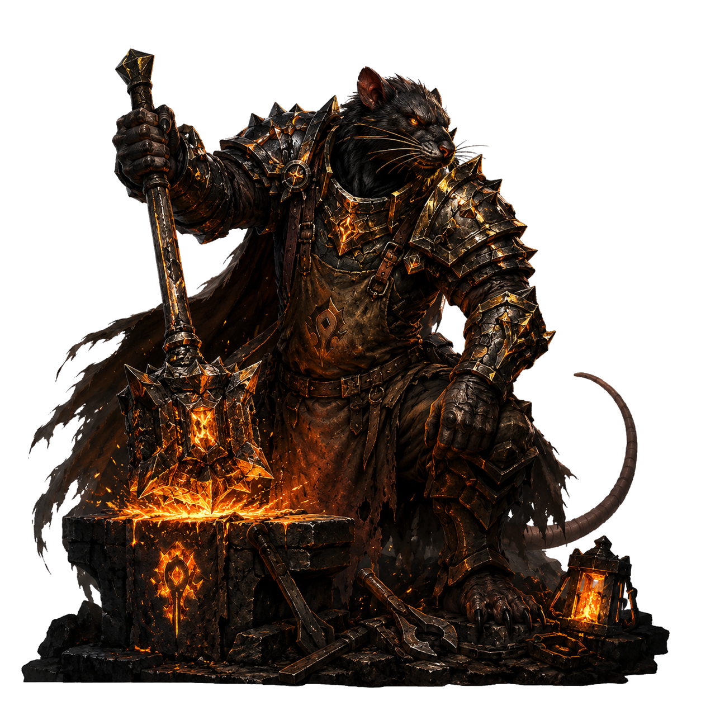
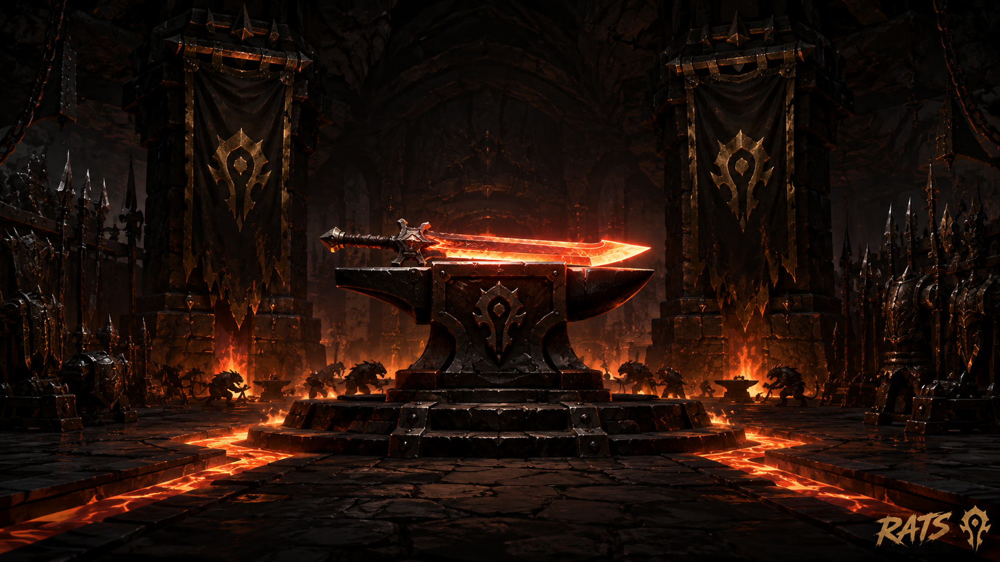
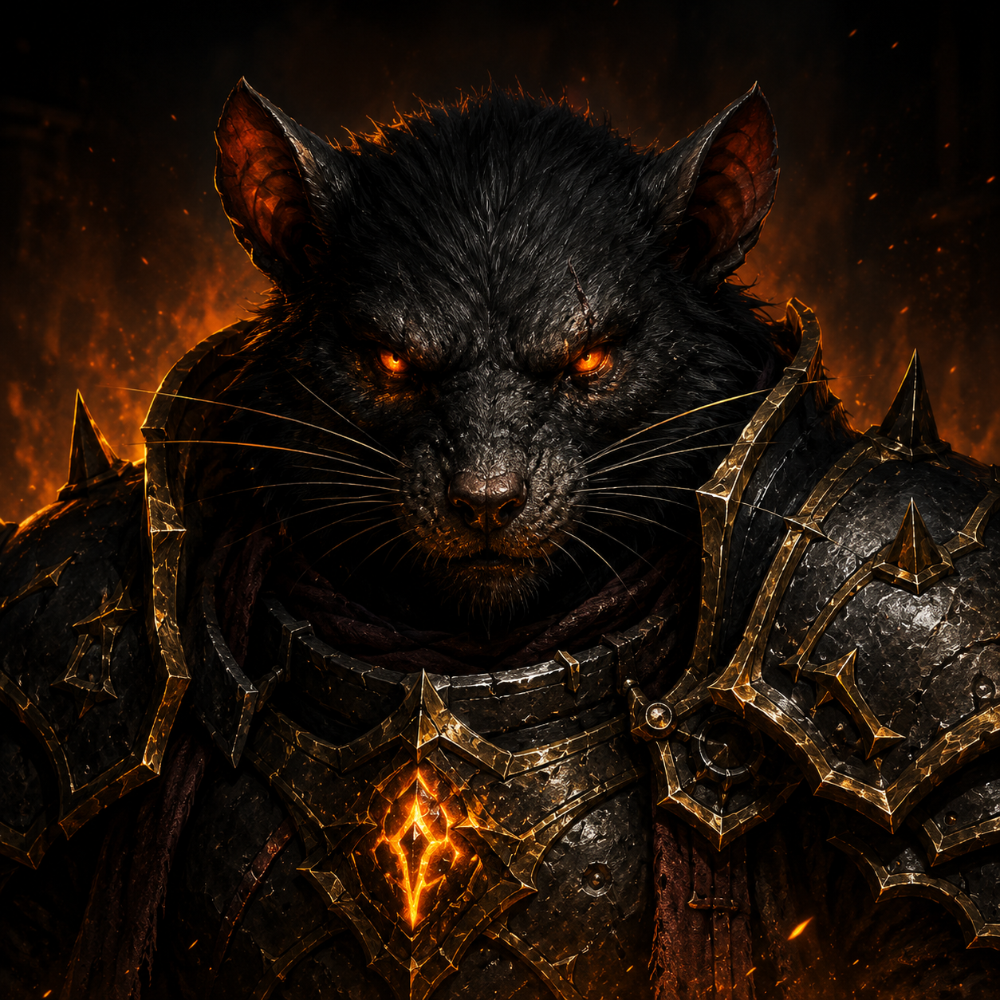

# ⚒️ Okanvil

### *"OK... Anvil."* — the guild toolkit that got hammered into shape.

**A raid & guild toolkit for WoW 3.3.5a / Warmane — one addon.**
Invites, loot tracking, combat logs, recruitment and an ID finder — all forged on one anvil. 🔨

 

&nbsp;

&nbsp;

 

 <em>Where the tools are hammered out — one rat, one anvil, no sleep. 🔥</em>

 

## 🔥 What is this?

Okanvil (yes, say it out loud — *"OK Anvil"* — you're welcome) started as one rat's private
workshop and grew into a **toolkit for the whole guild**. It's a single window with a left nav;
each tool is a **module you toggle on or off**. Officers get the raid gear; everyone else grabs the
ID finder to build their WeakAuras. Nobody's forced to carry what they don't use.

This isn't a reskin of anything — it's a **fresh rat**, built from scratch for 3.3.5a. 🐀

**One addon, everything inside.** No plugin zoo to manage — install `Okanvil`, and every tool is a
built-in module. Turn what you want on or off **per character**, while each tool's settings stay
**shared across your toons**: set up your recruit macros once, they follow you to every alt. 🧀

> *Named after its blacksmith, **Okanor** — the paladin who kept bashing on it until it stopped
> throwing errors (older rats may know him as **Okanata**). The anvil is both the logo and the
> promise: rough iron in, sharp tools out.*

 

## 🧰 On the anvil

A gold-themed **Home** dashboard (guild online roster, tiles, web-hub card) is always there. The six
tools below are modules you toggle in **Settings → Modules**:

| | Module | What it hammers out |
|:--:|:--|:--|
| ⚔️ | **Invite** | Mass-invite: whole guild online, by rank, or from saved lists. Keyword whisper invites and auto-invite on login. |
| 🐀 | **Guild** | Guild dashboard — online roster with rank colors, per-row invite, and a JSON roster export for the web hub. |
| 🎁 | **Loot** | Per-boss loot tracking with de-dupe and emblem/gem filtering. Inline session viewer, fair-loot priority. |
| 📜 | **Combat Logs** | One-click `/combatlog` with a movable REC timer, "log this instance?" prompt, and a session history that names the bosses you killed. |
| 🔎 | **ID Finder** | Find a spell/item **ID by name** for WeakAuras — offline spell library + item harvester. A reusable lookup API (`Okanvil.IDs`) other addons can call. |
| 📣 | **Recruit** | Recruitment advertiser with auto-reply and auto-invite, for officers & pug leaders. |

 

## 📥 Install

1. Grab **`Okanvil.zip`** from the **[Latest release](../../releases/latest)**.
2. Unzip it into `World of Warcraft\Interface\AddOns\` (you should end up with an `Okanvil` folder).
3. **Fully restart the game** — a brand-new addon won't show after just `/reload`.
4. Type **`/okanvil`** (or click the anvil on your minimap) and start forging.

One folder, everything inside. Toggle the tools you want in **Settings → Modules**.

 

## 🎨 Make it yours

Okanvil is the **product** (forged by Okanor); your **guild skin** is yours to set. In
**Settings → Branding**, drop your guild's name and it shows up next to the anvil in the header and
on the Home page. Point the web-hub button at your own site while you're there. The name *Okanvil*
stays — the swarm underneath it is whatever you make it. 🧀

 

## 🛠️ For tinkerers

Everything lives in one addon: `Okanvil/Core/` (the shell) and `Okanvil/Modules/` (the tools).
Push to `main` → a GitHub Action builds a clean, install-ready **`Okanvil.zip`** (dev files stripped)
and rolls the **Latest** release.

Design notes & roadmap → **[`Okanvil/PLAN.md`](Okanvil/PLAN.md)**.
SavedVariables layout (account-wide vs per-character — read before wiping/debugging saved data) → **[`docs/STORAGE.md`](docs/STORAGE.md)**.

 

 
⚒️ Forged by <b>Okanor</b> · Horde · Warmane-Onyxia · rough iron in, sharp tools out 🔥

