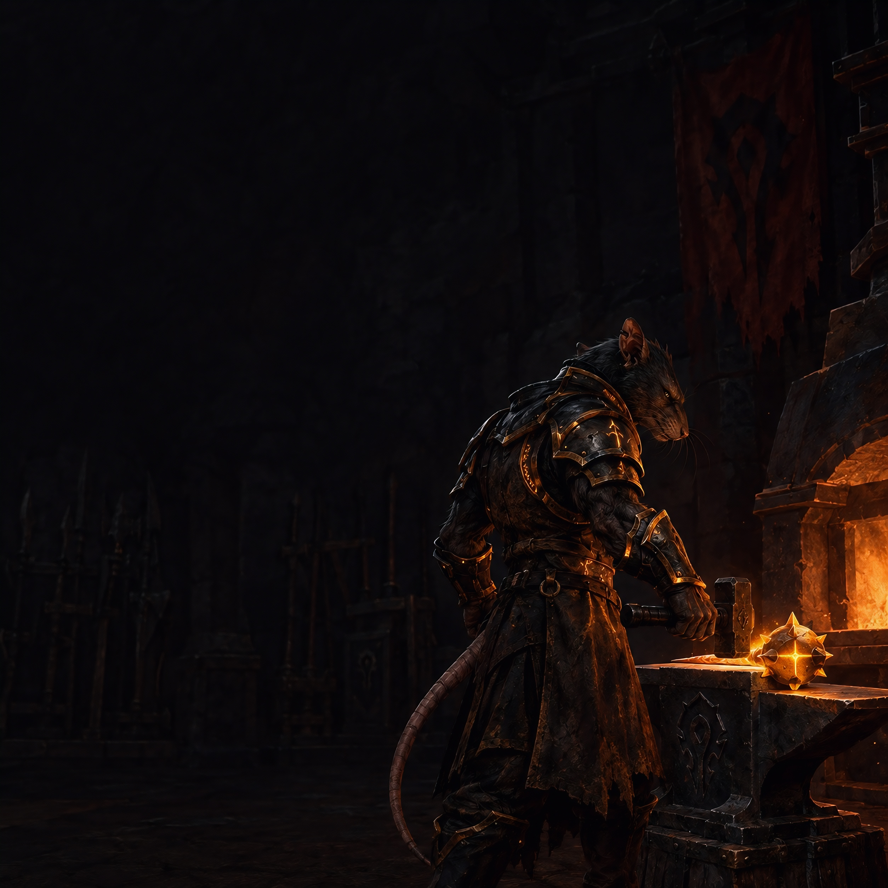

# ⚒️ Okanvil

### *"OK... Anvil."* — where all the tools are forged.

**The RATS raid & guild toolkit for WoW 3.3.5a / Warmane — one addon.**
Loot council, raid notes, loot tracking, a PuG builder, recruitment and more — all forged on one anvil. 🔨

 

&nbsp;

&nbsp;

 

 <em>Where the tools are hammered out — one rat, one anvil, no sleep. 🔥</em>

 

## 🔥 What is this?

Okanvil (yes, say it out loud — *"OK Anvil"* — you're welcome) started as one rat's private
workshop and grew into a **toolkit for the whole guild**. It's a single window with a left nav;
each tool is a **module you switch on or off**. Raiders keep the two essentials, officers get the
raid-leading gear, and nobody carries what they don't use.

This isn't a reskin of anything — it's a **fresh rat**, built from scratch for 3.3.5a. 🐀

**One addon, everything inside.** Install `Okanvil` and every tool is a built-in module. Modules
are switched **per character**, while each tool's settings stay **shared across your toons**: write
your recruit message once, it follows you to every alt. 🧀

> *Named after its blacksmith, **Okanor** — the paladin who kept bashing on it until it stopped
> throwing errors (older rats may know him as **Okanata**). The anvil is both the logo and the
> promise: rough iron in, sharp tools out.*

 

## 🧰 On the anvil

A **Home** page is always there: who's online in the guild (invite or whisper from the row), the
guild's rank counts, and the last raids you were in.

### Essentials — every raider

| | Module | What it hammers out |
|:--:|:--|:--|
| 🏆 | **Loot Council** | When an officer puts items up, you get a popup: **BIS · Upgrade · Small · OS · Pass**. Officers see every answer on one board, next to the guild's loot priority, and award from there. Without the addon the council can't see you. |
| 📜 | **Notes** | Boss notes in MRT format that switch on as you walk into each room. Officers send them to the raid; guild WeakAuras read your assignment straight from them. |

### Extras — switch on what you use

| | Module | What it hammers out |
|:--:|:--|:--|
| 🎁 | **Loot history** | Every drop per boss and who got it, plus the **Mini Roll Manager** for MS/OS roll-offs and a speed-run master-loot sweep. |
| 📸 | **Raid snapshots** | Who was in each raid, one click to re-invite the lot. Feeds attendance on the guild website. |
| 🔍 | **Raid Finder** | Reads the LFM spam in chat and decodes it — reserved-loot lingo (`B`/`O`/`P`/`Frags`), roles, gear score — so you spot the run you want. |
| 👥 | **PuG** | Build a raid: pick the instance, set the roles, ask each role for the classes or specs you want, and spam a line that builds itself as people join. |
| 📣 | **Recruit** | Recruitment ads with auto-reply and auto-invite. |
| 📼 | **Combat Logs** | Starts combat logging at the first pull, with a REC timer so you know it's running. |
| 🔎 | **ID Finder** | Find a spell or item **ID by name** for WeakAuras. |
| 💰 | **Farm** | Gold per hour while you farm, and a log of past runs. |

**Officer tools show up on their own** for officers: the Loot Council setup, the website exports,
and the master-loot tools. Raiders never see them.

 

## ✨ Built for raid night

- **Quiet in combat.** Background work (roster bookkeeping, sync, chat scanning for other raids)
  waits until the pull is over. What you switched on yourself keeps going: the council keeps
  collecting votes through trash, and your PuG or recruit spam keeps posting.
- **See what's running.** Green chips in the title bar show anything still going in the background
  — recruit ads, PuG spam, council night, a farm timer, combat logging. Click one to jump to it.
- **Who has it?** *Settings → Version check* lists who in the group or guild runs Okanvil, and
  whispers a download link to everyone who doesn't.
- **A short setup on first login.** It reads your guild rank, keeps the essentials on and asks
  which extras you want.

 

## 📥 Install

1. Grab **`Okanvil.zip`** from the **[Latest release](../../releases/latest)**.
2. Unzip it into `World of Warcraft\Interface\AddOns\` (you should end up with an `Okanvil` folder).
3. **Fully restart the game** — a brand-new addon won't show after just `/reload`.
4. A short setup opens on first login. After that, type **`/okanvil`** or click the anvil on your minimap.

 

## 🎨 Make it yours

Okanvil is the **product** (forged by Okanor); your **guild skin** is yours to set. Type
**`/okanvil brand <name>`** and your guild's name shows up next to the anvil; **`/okanvil hub <url>`**
points the web-hub link at your own site. Don't like the forge art behind the window? Switch it off
or tone it down in *Settings → General*. The name *Okanvil* stays — the swarm underneath it is
whatever you make it. 🧀

 

## 🛠️ For tinkerers

Everything lives in one addon: `Okanvil/Core/` (the shell) and `Okanvil/Modules/` (the tools).

**Releases are automatic.** Every push to `main` makes a GitHub Action bump the version, tag it,
build a clean install-ready **`Okanvil.zip`** (dev files stripped), publish the release and announce
it on Discord. The version is derived from the last tag — **never hand-edit `## Version:` in the
`.toc`**; the Action stamps it at build time. Steer the bump with a keyword anywhere in the commit
message:

| commit message | `1.2.1` becomes | use for |
|:--|:--|:--|
| *(no keyword)* | `1.2.2` | bug fix — the default |
| `… [minor]` | `1.3.0` | new module or feature |
| `… [major]` | `2.0.0` | breaking change (e.g. wipes SavedVariables) |
| `… [skip]` | *no release* | docs / CI-only push |

A 3.3.5a addon can't make HTTP requests, so it can't check GitHub for updates. The version check
asks your group or guild over the addon channel instead, on demand.

Custom art has to be **BLP2 DXT5** (square or power-of-two, up to 1024) to load in this client;
`scripts/png2blp_dxt5.py` converts a PNG/JPG. See [`Okanvil/Media/README.md`](Okanvil/Media/README.md).

**Reference reading**

- Working notes — conventions, 3.3.5a traps, the map to everything → **[`docs/NOTES.md`](docs/NOTES.md)**
- Slash commands → **[`docs/SLASH_COMMANDS.md`](docs/SLASH_COMMANDS.md)**
- SavedVariables layout (account-wide vs per-character — read before wiping/debugging saved data) → **[`docs/STORAGE.md`](docs/STORAGE.md)**
- How the loot council works → **[`docs/LOOT_COUNCIL.md`](docs/LOOT_COUNCIL.md)**

 

 
⚒️ Forged by <b>Okanor</b> · Horde · Warmane-Onyxia · rough iron in, sharp tools out 🔥

